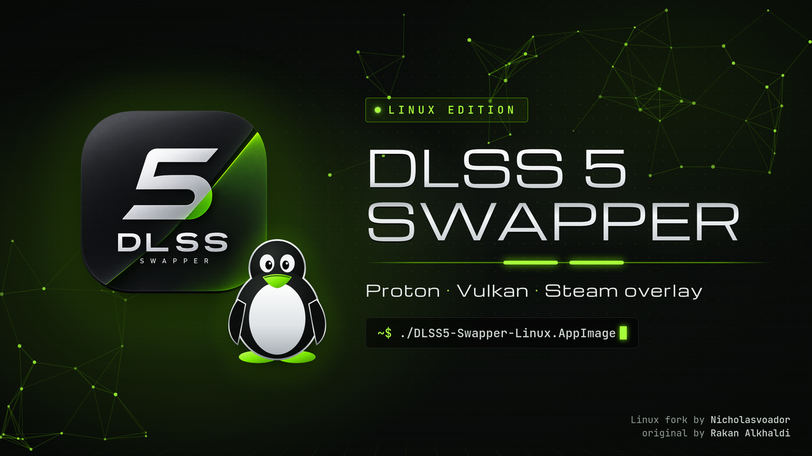

<p align="center">
  
</p>

<h1 align="center">DLSS 5 Swapper for Linux</h1>

<p align="center">
  A Linux-native fork of <a href="https://github.com/rakanki911/DLSS5-Swapper">DLSS 5 Swapper</a>.<br>
  Install, tune and restore DLSS 5 Neural Rendering in your Steam games under Proton, and in native Vulkan games, with no Windows install.
</p>

<p align="center">
  <a href="https://github.com/Nicholasvoador/DLSS5-Swapper-Linux-Support/releases/latest"></a>
  <a href="https://github.com/Nicholasvoador/DLSS5-Swapper-Linux-Support/releases"></a>
  
  
  <a href="https://github.com/rakanki911/DLSS5-Swapper"></a>
  
</p>

## Download

**[Latest release →](https://github.com/Nicholasvoador/DLSS5-Swapper-Linux-Support/releases/latest)**

| Package | For | Install |
|---|---|---|
| `.AppImage` | any x86_64 distro | `chmod +x DLSS5-Swapper-Linux-*.AppImage`, then run it |
| `.rpm` | Fedora, openSUSE, RHEL | `sudo dnf install ./DLSS5-Swapper-Linux-*.rpm` |
| `.deb` | Debian, Ubuntu, Mint, Pop!_OS | `sudo apt install ./DLSS5-Swapper-Linux-*.deb` |

Check what you downloaded against the `SHA256SUMS.txt` published with each release:

```sh
sha256sum -c SHA256SUMS.txt --ignore-missing
```

On first run the app downloads the DLSS 5 runtime it needs from upstream's release and checks it against a pinned SHA-256 before using it. Neither this repository nor its packages contain any NVIDIA files.

**You need:**
- An NVIDIA RTX card with NVIDIA's proprietary driver. The GPU rules are the same as upstream's: RTX 20–50 for the ReShade and Feeder routes; OptiScaler's bundled model needs an RTX 50.
- Steam with Proton. This can be Valve's Proton or a custom tool like Proton-GE or Proton-CachyOS.

## What the Linux build does

- **Finds your games and their Proton prefixes.** It looks in every Steam library and works out which Proton each game last ran with, the same way Steam records it (`config_info`, then `CompatToolMapping`). Custom tools in `compatibilitytools.d` count too.
- **Runs Windows-only setup inside the game's own prefix.** ReShade's setup runs through the game's own Proton. Everything else is ordinary file copies.
- **Reaches native Linux Vulkan games** through [DLSS5VKLayer](https://github.com/bmitch87/DLSS5VKLayer) (`dlssnr`). The app downloads a pinned, SHA-256-checked release and installs it for your user with the layer's own installer. It then puts the layer's wrapper in front of `%command%` in the game's Steam launch options, and takes it out again when you restore. Steam overwrites launch options when it exits, so the app only makes this edit while Steam is closed. If Steam is running, the app tells you what to paste in or remove instead.
- **Launches games through Steam.** The Play button (Theme 2's game page) starts Steam games via `steam://rungameid`, so the Steam overlay (Shift+Tab) loads alongside DLSS 5. Starting the game from Steam itself works the same way.
- **Ships newer add-ons than upstream 2.2.9:** RenoDX DLSS5 **8.5.0-rc10** and the multipass DLSS Tool **SF 26.1003.2350**. Each download and each file in it is SHA-256 checked before it replaces anything.
- **Updates itself and its RenoDX add-ons from inside the app** (About → Updates). Nothing happens until you press a button and confirm.
  - **The app:** downloads the next fork release and checks it against both GitHub's published digest and the release's `SHA256SUMS.txt`. Then it installs it the way you installed it, and restarts. An AppImage replaces itself; an rpm or deb goes through `dnf` or `apt`, and your system asks for your password.
  - **RenoDX add-ons:** a newer build than this release ships is checked against GitHub's digest and must be a 64-bit Windows add-on before it is used. **Back to** returns to the shipped build.
- **Keeps up with upstream.** The Updates panel shows whether the original has a newer release. Upstream changes reach Linux through a new fork release, which the app can then install.
- **Has the same opt-in Community page and live chat as upstream,** on upstream's server.

## Routes on Linux

| Game | Routes offered |
|---|---|
| Proton, DirectX 8–12 or OpenGL | Upstream's routes: RenoDX, DLSS5-Feeder, multipass, OptiScaler when eligible |
| Proton, Vulkan | All of the above, plus **DLSS5VKLayer** |
| Native Linux, Vulkan | **DLSS5VKLayer** |
| Native Linux, OpenGL | Not supported |

The ReShade-based routes (RenoDX, Feeder, multipass) need Wine to load the ReShade DLL from the game's folder instead of its own. The app doesn't set this yet, so add an override to the game's Steam launch options. For a DirectX 10–12 game that's:

```
WINEDLLOVERRIDES="dxgi=n,b" %command%
```

The Control run below used `WINEDLLOVERRIDES="dxgi=n,b;d3dcompiler_47=n"`.

## Tested

| Game | Route | Result |
|---|---|---|
| **Control** (DX12) | RenoDX 8.5.0-rc10 | ✅ Neural rendering engaged on 19,527 of 19,528 frames, about 65 fps at 2560×1440; Steam overlay working |
| **The Witcher 3** (DX12) | — | ❌ NVIDIA Streamline refuses to load its DLSS module once it detects Wine |

Test machine: Fedora 44, KDE Plasma 6 (Wayland), RTX 5070, driver 615.71, Proton-GE.

That's one machine and one working game so far. If you try another, post a report on the in-app Community page so everyone can see it.

## Known limits

- **The F8 in-game panel isn't in the Linux packages.** It talks to the app over a Windows named pipe, which only exists inside Wine. RenoDX's own page in the ReShade overlay (**Home** key) has the same sliders.
- **Streamline games can refuse DLSS under Wine,** as The Witcher 3 does.
- **The DLL overrides above are manual for now.**
- **RenoDX 8.x dropped *Global Tone Intensity*,** so that control is gone with this build.
- **Anti-cheat works as upstream:** you get a warning, and nothing is ever bypassed.

## Versions and upstream

A release is named `<upstream version>-linux.<n>`. For example, `2.2.9-linux.2` is upstream 2.2.9 plus the second Linux release on top of it. This fork rebases onto [rakanki911/DLSS5-Swapper](https://github.com/rakanki911/DLSS5-Swapper) as upstream moves. Maintainers can use:

```sh
scripts/sync-upstream.sh          # report what upstream has that this branch doesn't
scripts/sync-upstream.sh --pull   # rebase onto upstream, then run the tests
```

Release notes: [v2.2.9-linux.3](../docs/releases/v2.2.9-linux.3.md) · [v2.2.9-linux.2](../docs/releases/v2.2.9-linux.2.md) · [all releases](https://github.com/Nicholasvoador/DLSS5-Swapper-Linux-Support/releases)

## Build from source

```sh
git clone https://github.com/Nicholasvoador/DLSS5-Swapper-Linux-Support
cd DLSS5-Swapper-Linux-Support
npm ci
npm test
npm run start:linux    # run from source
npm run build:linux    # AppImage, deb and rpm in dist/
```

## Everything else

Features, the emulator list, the 38 languages and screenshots are all upstream's work, so they're described in the [upstream README](https://github.com/rakanki911/DLSS5-Swapper#readme). The same app runs here.

<p align="center">
  
</p>

## Community and privacy

The Community page and chat are opt-in, and they use upstream's server (`5.rakanki.com`), run by upstream's author. A report is sent only after you review it, and it holds only the fields shown in its dialog: game, route, rendering API, result, optional comment, GPU, driver, CPU, OS and app version. Upstream's README has the [details](https://github.com/rakanki911/DLSS5-Swapper#community-and-privacy).

## Credits

- **[DLSS 5 Swapper](https://github.com/rakanki911/DLSS5-Swapper)** by **Rakan Alkhaldi**, MIT. If it saves you an evening, [buy him a coffee](https://buymeacoffee.com/rakanki911).
- **Linux port** by **[Nicholasvoador](https://github.com/Nicholasvoador)**, under the same MIT licence.
- **[DLSS5VKLayer](https://github.com/bmitch87/DLSS5VKLayer)** by bmitch87, AGPL-3.0. It is downloaded and run as a separate program, never bundled or linked.
- **RenoDX DLSS5 add-ons** are downloaded at runtime from [RankFTW's rhi-repo](https://github.com/RankFTW/rhi-repo) releases.
- [Third-party credits and licences](../THIRD_PARTY_NOTICES.md)

Not affiliated with NVIDIA or Valve. DLSS is a trademark of NVIDIA Corporation.
